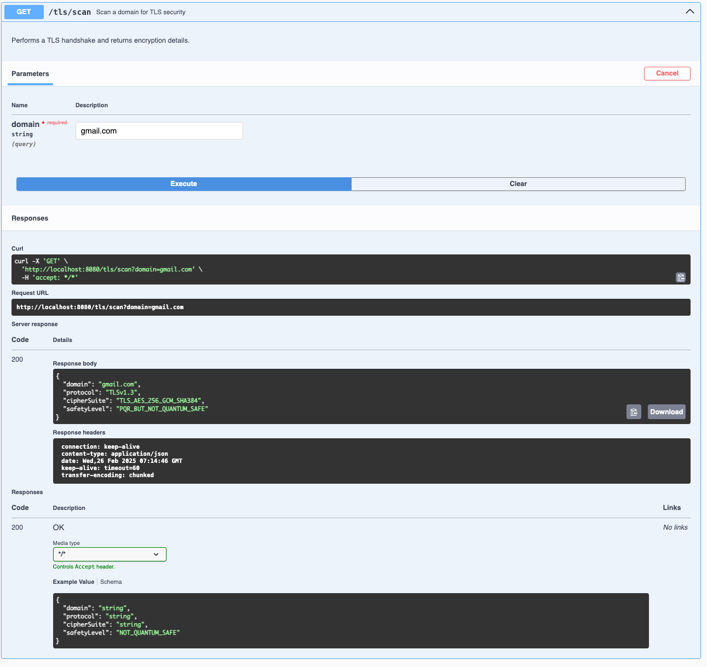
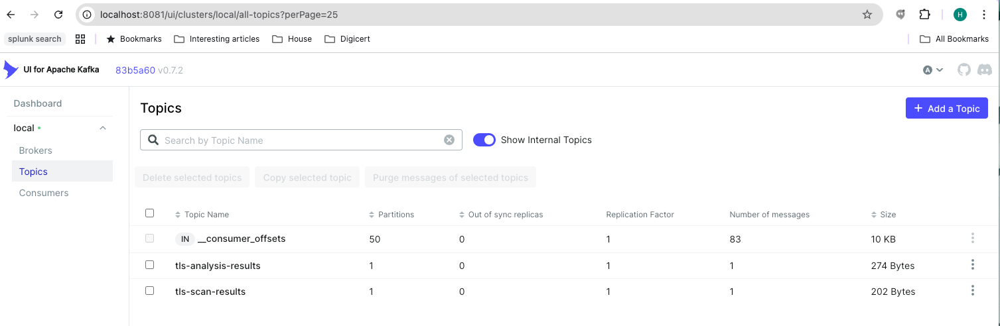
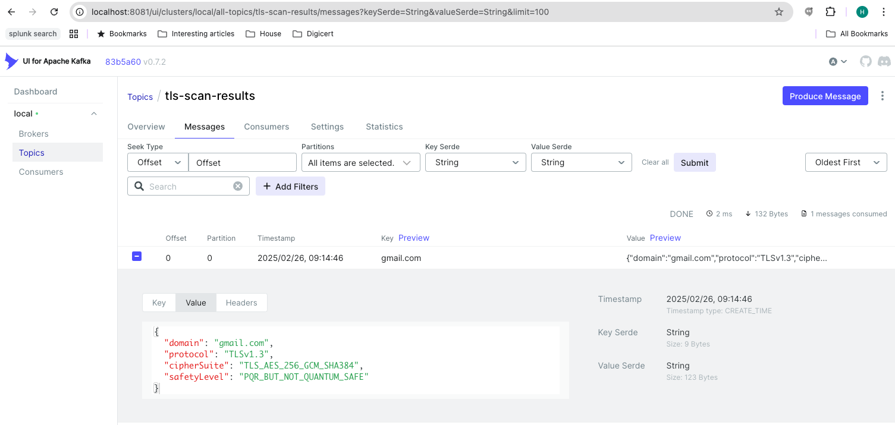
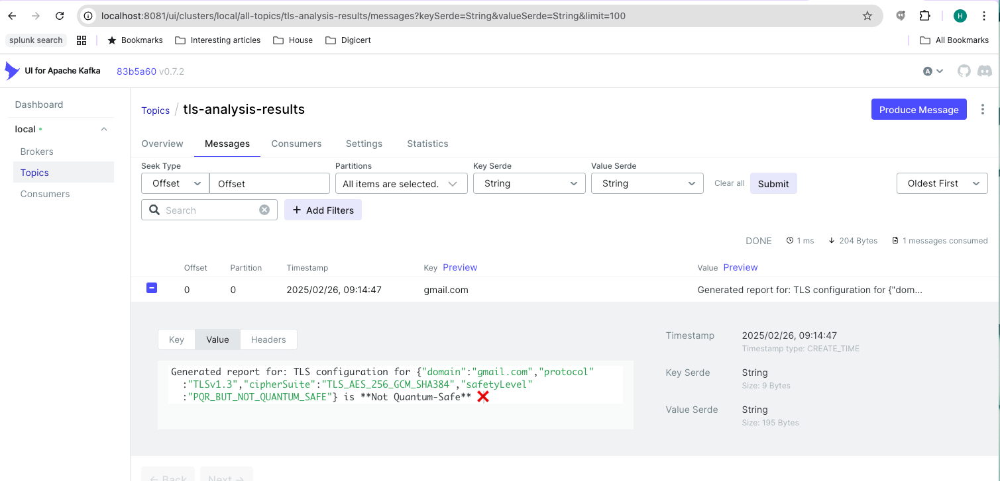

# QTRA Application

## Overview

The Quantum Threat Risk Assessment (QTRA) application scans websites for TLS vulnerabilities and assesses their quantum risk using AI agents. It utilizes Kafka for messaging between components.

## Features
- **TLS Scanning**: Analyzes a given domain’s TLS configuration.
- **Quantum Risk Assessment**: Determines if the TLS setup is safe against quantum threats.
- **AI Agents**: Automate the risk evaluation and reporting.
- **Kafka Integration**: Uses Kafka for processing and real-time data streaming.
- **Kafka UI**: Provides an intuitive interface to monitor Kafka messages.
- **Swagger UI**: Interactive API documentation.

---

## Prerequisites

Make sure you have the following installed on your machine:

- Docker
- Docker Compose

---

## Running the Application

1. **Clone the repository** (if you haven't already):

   ```bash
   git clone <repository-url>
   cd <repository-directory>

2. **Build and start the Docker containers using Docker Compose:**

   ```bash
   docker-compose up -d --build
   ```

This starts:

- Zookeeper
- Kafka
- Spring Boot QTRA application
- Kafka UI (available at http://localhost:8081)
- Swagger UI (available at http://localhost:8080/swagger-ui.html)

**Testing the TLS Scan Endpoint**

Send a request to the TLS scan endpoint using curl (or use the provide Swagger UI). 

Replace https://example.com with the URL you want to scan:
```bash
curl -X GET "http://localhost:8080/tls/scan?domain=example.com"

```

You should receive a response containing the TLS scan results.

```json
{"domain":"example.com","protocol":"TLSv1.3","cipherSuite":"TLS_AES_256_GCM_SHA384","safetyLevel":"PQR_BUT_NOT_QUANTUM_SAFE"}
```

Invoke via SwaggerUI



**Verifying Message Publication and Consumption**

To verify that messages are being published and consumed as expected, follow these steps:

*Check Kafka Topics*

Open Kafka UI in your browser: http://localhost:8081

Navigate to the Topics section to view the available topics:

 - tls-scan-results: Contains the results of the TLS scans.
 - tls-analysis-results: Contains the final analysis reports.
 - Click on a topic to view messages. You can also consume messages from each topic and see the details of each message in a user-friendly format.

Topics


tls-scan-results: Contains the results of the TLS scans.


tls-analysis-results: Contains the final analysis reports.


Alternatively, list all Kafka topics directly from your host machine:

```bash
docker exec -it qtra-kafka kafka-topics --bootstrap-server localhost:9092 --list
__consumer_offsets
tls-analysis-results
tls-scan-results
```

Replace <kafka-container-name> with the name of your Kafka container (usually something like kafka or qtra-kafka).

Describe the tls-scan-results topic to see the configuration:

```bash
docker exec -it qtra-kafka kafka-topics --bootstrap-server localhost:9092 --describe --topic tls-scan-results

Topic: tls-scan-results	TopicId: 0gJiI7ohQjCf1hnfoxSGKw	PartitionCount: 1	ReplicationFactor: 1	Configs:
	Topic: tls-scan-results	Partition: 0	Leader: 1	Replicas: 1	Isr: 1	Elr: N/A	LastKnownElr: N/A
```

Describe the tls-analysis-results topic similarly:
```bash
docker exec -it qtra-kafka kafka-topics --bootstrap-server localhost:9092 --describe --topic tls-analysis-results
Topic: tls-analysis-results	TopicId: y5b6nJHQRrydQktL1gKL1w	PartitionCount: 1	ReplicationFactor: 1	Configs:
	Topic: tls-analysis-results	Partition: 0	Leader: 1	Replicas: 1	Isr: 1	Elr: N/A	LastKnownElr: N
```

View Published Messages

Use the Kafka console consumer to read messages from the tls-scan-results topic directly:
```bash
docker exec -it qtra-kafka kafka-console-consumer --bootstrap-server localhost:9092 --topic tls-scan-results --from-beginning

{"domain":"example.com","protocol":"TLSv1.3","cipherSuite":"TLS_AES_256_GCM_SHA384","safetyLevel":"PQR_BUT_NOT_QUANTUM_SAFE"}
^CProcessed a total of 1 messages
```

In another terminal, view messages from the tls-analysis-results topic:

```bash
docker exec -it qtra-kafka kafka-console-consumer --bootstrap-server localhost:9092 --topic tls-analysis-results --from-beginning

Generated report for: TLS configuration for {"domain":"example.com","protocol":"TLSv1.3","cipherSuite":"TLS_AES_256_GCM_SHA384","safetyLevel":"PQR_BUT_NOT_QUANTUM_SAFE"} is **Not Quantum-Safe** ❌
^CProcessed a total of 1 messages

```

## Stopping the Application ##

To stop the application and remove the containers, you can run:

```bash
docker-compose down
```

## Troubleshooting ##

If you encounter issues with Kafka topics or message consumption, ensure that your Docker containers are running properly and that there are no errors in the application logs.
Check the Kafka logs for any warnings or errors related to message production or consumption.
Contributing
If you would like to contribute to this project, please open an issue or submit a pull request.